# **1 INTRODUCTION**
In this project for Augmented Reality we are going to explore techniques for inserting images into a live scene in reality without any predefined template or ArUco marker.

To make it possible to project an image or object onto a surface, the algorithm should identify the surface and maintain the projection on a fixed position regardless of the camera view movement. One popular method being used nowadays is Location-Based Markerless Augmented Reality [1], which is well demonstrated by the mobile game Pokémon Go. It makes use of GPS and other location-based technologies to perform the object projection. This method has been widely used in different industries such as tourism, education, and advertising.

Besides, there is technique called Natural feature tracking (NFT) [2]. This is literally still marker tracking, but it uses natural features such as shapes, textures, or corners. With calibration, NFT can be used to fix the projection without specifying any predefined markers.

Another common technique adopted by technology leads is the use of inertial sensors. Examples such as ARCore by Google, HoloLens by Microsoft, and ARKit by Apple combines the use of built-in device sensors including odometry, gyroscopes, and accelerometers, provide robust and accurate positioning indoor and outdoor scenarios [3]. There is also a system called Parallel Tracking and Mapping (PTAM) that can do real-time 6-DOF camera tracking in small scenes [8]. One common principle used by the libraries is Simultaneous Localization and Mapping (SLAM). 
# **2 METHODOLOGY**
SLAM includes front-end processing, which is mainly dependent on sensors; and back-end processing that involves image processing, calculation, and optimization. This project is going to demonstrate how the backend processing of SLAM can perform the basis of Enhanced Augmented Reality by fixing an image projection on a particular position [4].

As an initial step, the input image (poster) will be warped to the surface shown in the video by a set of predefined 4-points coordinates. The process is to find the perspective transform using 4 points between source and destination, then image projection can be done using the homography matrix. Next the following steps will be performed throughout the video, frame by frame.

1. Using matching features between frames to track the camera motion. All source points and destination points of identified features between frames are located.
1. Find the perspective transform between frames using all identified points.
1. With the identified perspective transform, from the original locations of the poster, calculate the new coordinates of poster.
1. Then similar to the initial step, but use the new coordinates calculated in step 3 instead of the predefined coordinates, to warp the poster to the surface.

The method described should be able to handle different camera views including rotation, projected image being partially visible, outside the scene, and then back to the scene, as long as most features remained discoverable between frames.
# **3 RESULT**
Note the videos are filmed in FHD instead of HD as the minimum requirement specified, due to a limitation on the filming device. Longer processing time is expected for the higher resolution input. For the three experiments, each will have its own scene with different lighting and features. Various feature detection methods ORB, SIFT, SURF, BRIEF will be examined [5]. Also, two major feature matching methods Brute-Force (BF) and Flann-based Matching will be tested. The best result of each individual scene will be shown with sampled images and statistics, followed by the summary comparison.
## **3.1 First scene – indoor with some outdoor background** 
### **Result video**

### **Screen capture at different scenarios**
|
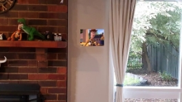

fig 3.11 – initial position
|
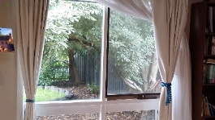

fig 3.1b – partially visible, picture slightly skewed
|
| :-: | :-: |
|
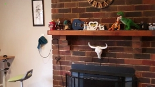

fig 3.1c – outside
|
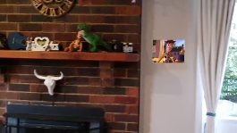

fig 3.1d – back to the scene, a few pixels away from original position
|
|
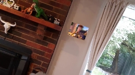

fig 3.1e – rotate left, staying on position
|
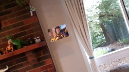

fig 3.1f – rotate right, staying on position
|

|**Video Info**||**Major Process**|**Runtime (s)**|
| :- | :- | :- | :- |
|Length|14s|Matching Features (1) |59\.17|
|Frame number|491|Finding Homography (2)|0\.82|
|Detect method|ORB|Warping Image (4)|2\.88|
|Matching method|Flann|Video IO|10\.03|
|Used feature number |2500|||
|Average no. of matching features|2075\.39|**Total Process Time**|74\.97|
## **3.2 Second scene – outdoor scene with building and tree as features**
### **Result video**

### **Screen capture at different scenarios**
|
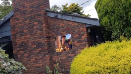 

fig 3.2a – initial 
|
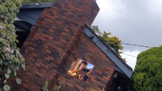

fig 3.2b – rotate right
|
| :-: | :-: |
|
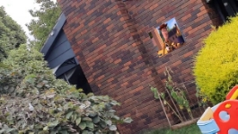

fig 3.2c – rotate left
|
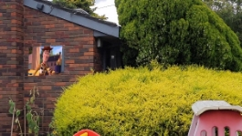

fig 3.2d – panning right, a few pixels away from initial position
|
|
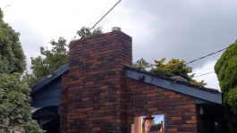

fig 3.2e – partially visible, staying on position
|
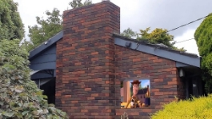

fig 3.2f – back to the scene, staying on position
|

|**Video Info**||**Major Process**|**Runtime (s)**|
| :- | :- | :- | :- |
|Length|9s|Matching Features (1) |64\.10|
|Frame number|446|Finding Homography (2)|0\.47|
|Detect method|ORB|Warping Image (4)|2\.53|
|Matching method|Flann|Video IO|10\.35|
|Used feature number |1500|||
|Average no. of matching features|1206\.58|**Total Process Time**|79\.75|
## **3.3 Third scene – indoor scene with various items** 
### **Result video**

### **Screen capture at different scenarios**
|
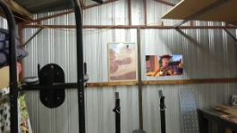

fig 3.3a – initial 
|
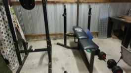

fig 3.3b – outside
|
| :-: | :-: |
|
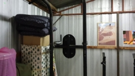

fig 3.3c – partially visible, slightly skewed
|
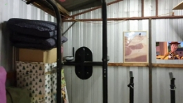

fig 3.3d – back to the scene, stay on position
|
|
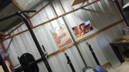

fig 3.3e – rotate right, stay on position
|
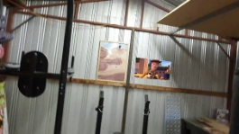

fig 3.3f – rotate left, stay on position
|

|**Video Info**||**Major Process**|**Runtime (s)**|
| :- | :- | :- | :- |
|Length|17s|Matching Features (1) |39\.51|
|Frame number|560|Finding Homography (2)|0\.38|
|Detect method|ORB|Warping Image (4)|3\.06|
|Matching method|BF|Video IO|11\.42|
|Used feature number |500|||
|Average no. of matching features|322\.56|**Total Process Time**|56\.64|
## **3.4 Summary**
ORB (Oriented FAST and Rotated BRIEF) [6] is found to be the fastest method among all examined detection methods, regardless of scene and features. Plann-based Matcher [7] generally has better performance on experiment that requires high number of features, but for the one with low number of features it is outperformed by BF. In general, the most time consuming process is **matching features**, costing around 80% of the entire process. Besides, the scene with more distinguishable features (in terms of corners, lines, colours, and unique objects) would require few numbers of features to generate a transform matrix giving accurate output. Below is a summary concluding the performance and requirement for a proper output of the experiments.

|Experiment|1|2|3|
| :- | :- | :- | :- |
|Min no. of features required for accurate result|2500|1500|500|
|Matching method giving better performance |PLANN|PLANN|BF|
|Average no. of good matching features between frames|2075\.39|1206\.58|322\.56|
|Time spent on matching features|59\.17s|64\.10|39\.51|
|Time spent on matching features per frame |0\.120509s|0\.143722s|0\.070553s|
|Video length|14s|9s|17s|

The above table shows optimized result with tunning by trial-and-error on FHD videos. To make it close to real-time performance, excluding trivial IO and warping time there is a need to increase the processing power to at least 3 to 7 times for the conducted experiments, which are currently done on a desktop from 2012 using i5-3470 and 8GB RAM. Therefore, it should be fairly easy for the common machine nowadays to generate output of above experiments on HD videos in real-time.

# **4 LIMITATION**	

From the experiments, the projected image does not always perfectly align to the fixed position. Occasionally it got skewed or misplaced a few pixels from its original positions. From repeated experiments on different poster position or scenes (some cannot be shown due to the scope limitation of the report), there are some findings concluded.

- When features on the scene are not obvious, e.g., plain wall, the marker cannot stay on the same position properly because the homography matrix cannot be calculated with enough matching features. 
- When there are too many repeating features, e.g., bricks, the marker may jump off the position as the confusing matching features produce an incorrect homography matrix.
- If there is occlusion, poster may overlap the occlusion as it cannot differentiate the depth.
- If there is too much noise, performance is worse because of mismatching features.
- When camera view is moving too quickly, the matching features test may fail the ratio test and lower accuracy would result.
- When the camera is rotating instead of panning (especially at a short distance to the surface), skewed poster may result due to large view angle change.

# **5 POTENTIAL IMPROVEMENT**

For the best performance and accuracy, the choice of scene is one of the factors, it should have obvious indistinguishable non-repeating features. Another factor is probably the video quality, higher resolution with correct focus can present better features for the matching process. 

In the case where the choice of scene is not an option, some pre-defined parameter sets of detection and matching methods and corresponding threshold could be applied based on given scene for the best result. Artificial intelligence acts as a critical role for the scene detection and best parameter tuning as a result.

AI detection could also assist by performing pre-processing whenever required, for example, when the input is found to have too much noise, insufficient lighting, or requires white balance correction for better performance.

Furthermore, with the use of inertial sensor or even inexpensive camera providing depth information [9] with calibration can give us additional information to build a better SLAM model for inserting picture or 3D object accurately, which explains why ARCore and ARKit are getting popular nowadays.

# **6 RUNNING UNDER ANACONDA**
To run the experiments, use the command
`python .\experiment.py`

This will generate image and video files to .\output_images

There are 3 experiments, each of them can be executed separately. Under the main function of experiment.py, each experiement can be executed with following methods. Comment others out for individual execution.

		run_testing1()      # input ear_movie3.mp4, output to ear_output3.mp4 and ear_output3-N.png
		run_testing2()      # input ear_movie5.mp4, output to ear_output5.mp4 and ear_output5-N.png
		run_testing3()      # input ear_movie6.mp4, output to ear_output6.mp4 and ear_output6-N.png

# **7 REFERENCE**

1. “Location-Based AR Apps: Best Examples and Guide on How To Build.” Cleveroad Inc. - Web and App Development Company, www.cleveroad.com/blog/location-based-ar-apps-best-examples-and-guide-on-how-to-build. 
1. Park, J. et al. “Natural feature tracking for extendible robust augmented realities.” (1998).
1. Dabove, P., Ghinamo, G. & Lingua, A.M. Inertial sensors for smartphones navigation. SpringerPlus 4, 834 (2015). https://doi.org/10.1186/s40064-015-1572-8
1. andijakl, Post author By. “Basics of AR: SLAM – Simultaneous Localization and Mapping.” Andreasjakl.com, 21 Sept. 2018, www.andreasjakl.com/basics-of-ar-slam-simultaneous-localization-and-mapping/. 
1. “Feature Detection and Description.” OpenCV, opencv-python-tutroals.readthedocs.io/en/latest/py\_tutorials/py\_feature2d/py\_table\_of\_contents\_feature2d/py\_table\_of\_contents\_feature2d.html.
1. “ORB (Oriented FAST and Rotated BRIEF).” OpenCV, opencv-python-tutroals.readthedocs.io/en/latest/py\_tutorials/py\_feature2d/py\_orb/py\_orb.html#orb.
1. “Cv::FlannBasedMatcher Class Reference.” OpenCV, docs.opencv.org/3.4/dc/de2/classcv\_1\_1FlannBasedMatcher.html. 
1. Oxford-PTAM. “Oxford-PTAM/PTAM-GPL.” GitHub, github.com/Oxford-PTAM/PTAM-GPL.
1. J. Sturm, N. Engelhard, F. Endres, W. Burgard and D. Cremers, "A benchmark for the evaluation of RGB-D SLAM systems," 2012 IEEE/RSJ International Conference on Intelligent Robots and Systems, Vilamoura-Algarve, Portugal, 2012, pp. 573-580, doi: 10.1109/IROS.2012.6385773.

